# 🦸‍♂️ Avenger Identity Quest - Guessing Game

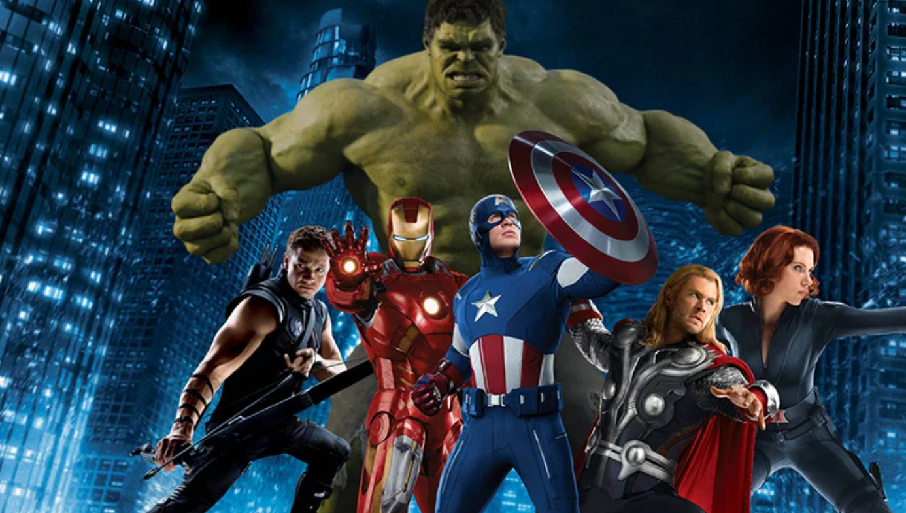

## 📖 The Story Behind This Project

Hey there! I'm **Mayank Gariya**, and I want to tell you about this fascinating journey I took building this Avengers character prediction model. 

You know that feeling when you're watching the MCU and you're absolutely captivated by each hero's unique abilities? That's exactly what inspired me to create this project. I spent considerable time modeling, testing, and refining custom datasets—particularly focusing on creating an **Irish folklore-inspired dataset** of Avengers data. The idea was to capture the essence of each hero's abilities, personality traits, and combat statistics in a way that felt authentic and engaging.

What started as a simple classification problem evolved into an interactive **AI-powered guessing game** where the model learns to identify which Avenger you're thinking of based on your responses. I went through multiple iterations of data preprocessing, feature engineering, and model optimization to make sure the predictions were as accurate as possible.

### The Journey:
- 🔍 **Data Exploration**: Analyzed multiple character attributes and behavioral patterns
- 🧪 **Experimentation**: Tested various ensemble methods and custom preprocessing techniques  
- 📊 **Refinement**: Customized the dataset to better capture character nuances
- 🎯 **Deployment**: Built an interactive Gradio interface for a seamless user experience

---
## workflow 
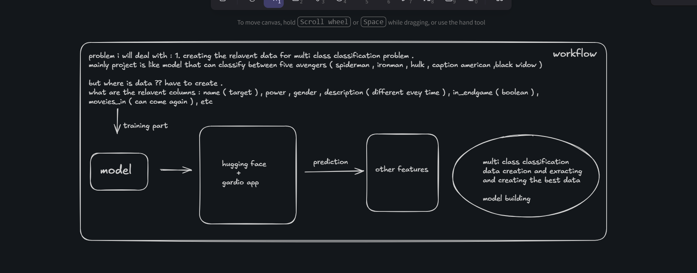

---
## 🎮 Try It Now!

**[Play the Avenger Guessing Game on Hugging Face Spaces](https://huggingface.co/spaces/realmanise/avenger-guess-game)**

The game is live and ready to test your knowledge! Think of one of the five core Avengers and answer a series of questions. Will the AI guess who you're thinking of?

---

## 📊 Project Overview

This is a **machine learning classification project** that predicts which Avenger you're thinking of based on character traits and abilities. The model uses ensemble techniques and natural language processing to analyze your descriptions and match them against a carefully curated dataset of Avenger characteristics.

### Core Heroes:
- ⚡ **Iron Man** - The Genius Billionaire
- 🛡️ **Captain America** - The Leader of Heroes
- 💚 **Hulk** - The Green Giant
- 🕷️ **Spider-Man** - The Friendly Neighborhood Hero
- ⚫ **Black Widow** - The Master Spy

---

## 🎯 How It Works

The application follows a step-by-step interactive quiz format:

1. **Describe Their Power** - Tell me about their unique abilities
2. **Select Gender** - Choose male or female
3. **General Description** - Share personality traits and appearance details
4. **Endgame Status** - Was this hero in Avengers: Endgame?
5. **Character Stats** - Use sliders to rate:
   - 🎬 Movies Appeared In
   - 💪 Strength Level
   - 🧠 Intelligence Level
   - 🏃 Agility Level

After answering all questions, the AI analyzes your responses and reveals which Avenger you were thinking of!

---

## 📈 Model Results & Performance

### Character Distribution:
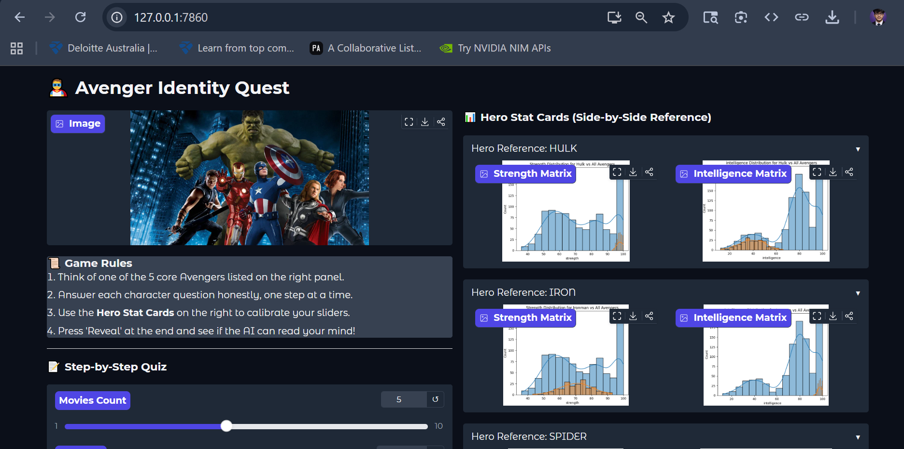

### Feature Importance & Predictions:
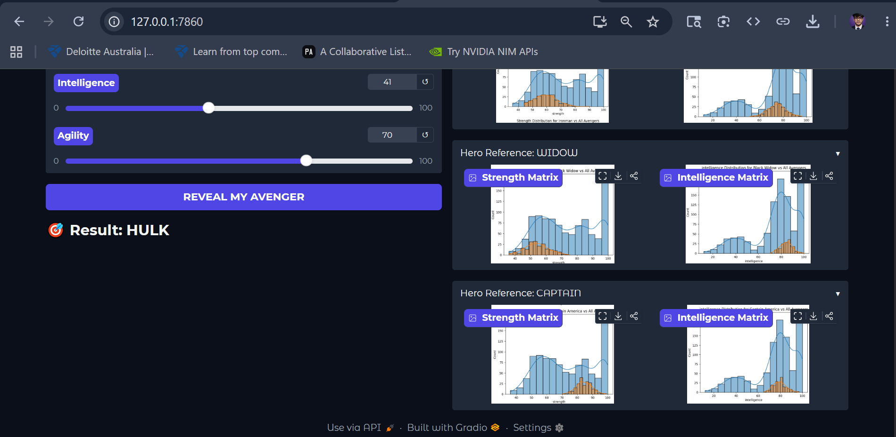

### Hero Statistics Reference:

#### Captain America - Combat Analyst
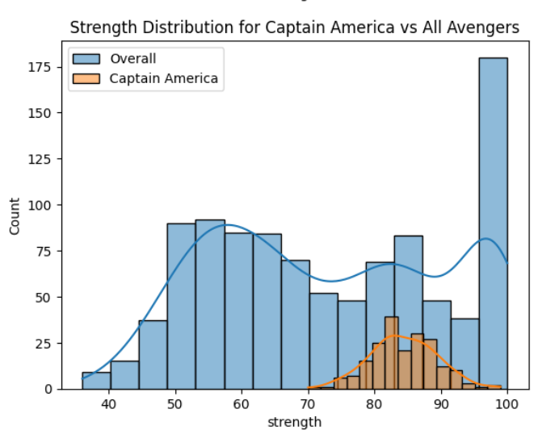
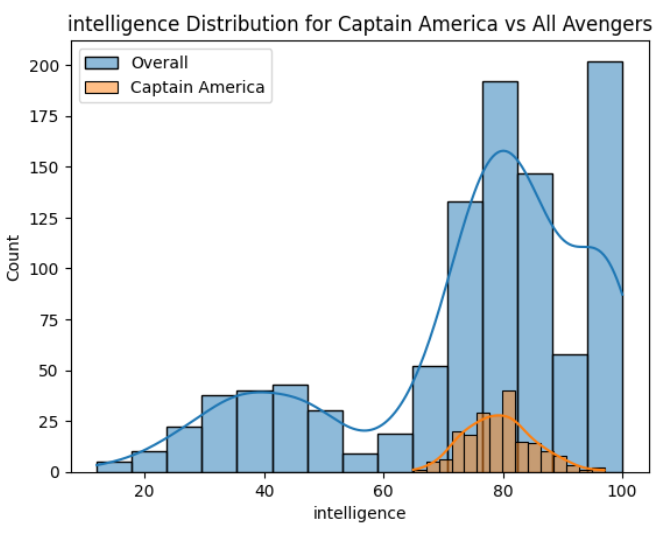

#### Iron Man - Tech Genius
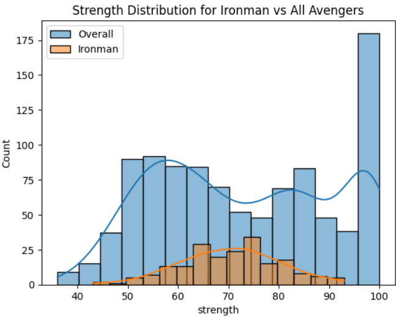
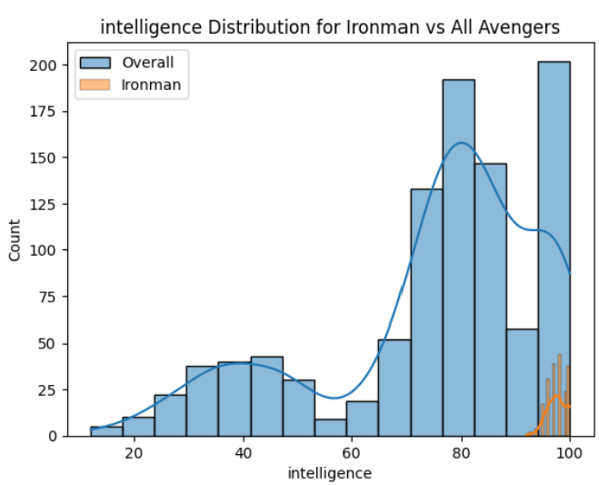

#### Hulk - Raw Power
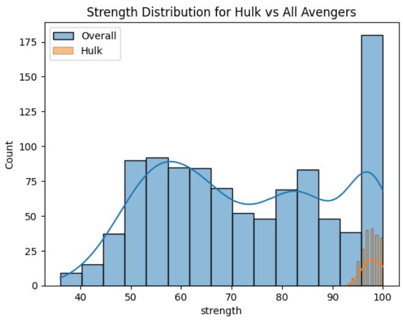
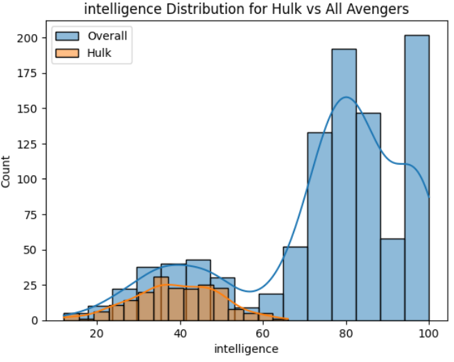

#### Spider-Man - Balanced Hero
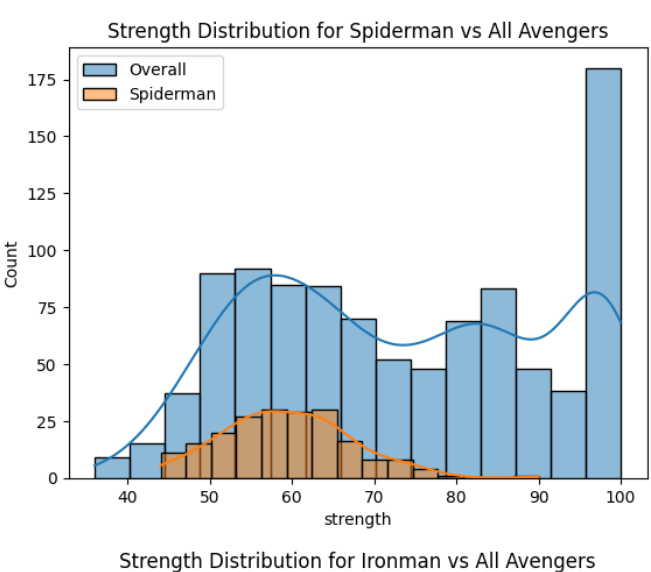
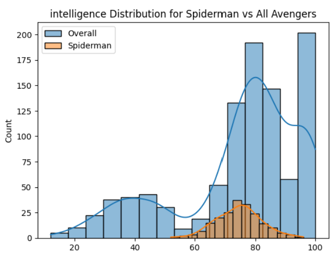

#### Black Widow - Tactical Expert
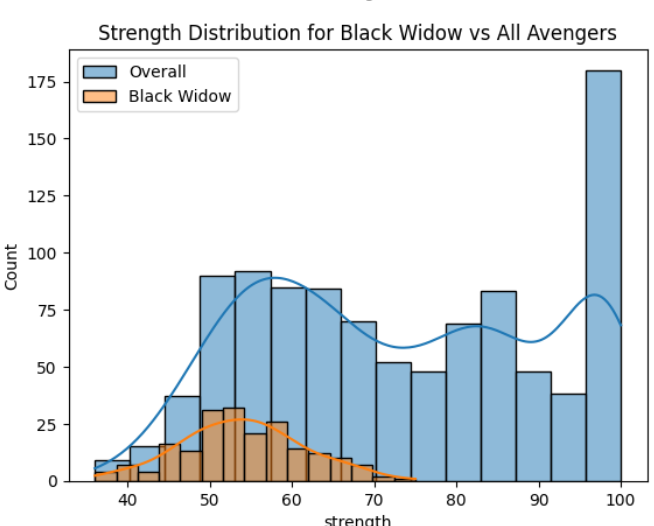
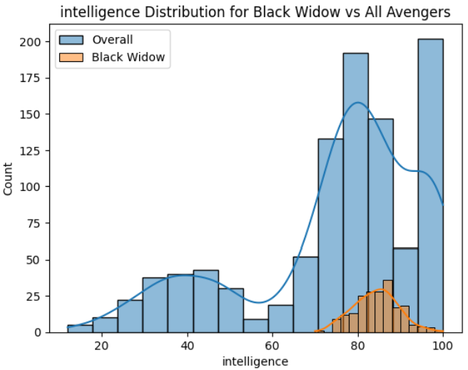

---

## 🛠️ Tech Stack

The project leverages cutting-edge tools and libraries:

### Machine Learning & Data Processing
-  **Scikit-Learn** - Classification & preprocessing
-  **NumPy** - Numerical computing
-  **Pandas** - Data manipulation & analysis

### NLP & Text Processing
-  **NLTK** - Natural language processing
  - Porter Stemming for text normalization
  - Stopwords removal for cleaner analysis
  - Tokenization for text parsing

### Web & Interface
-  **Gradio** - Interactive web interface
-  **Python 3** - Core language

### Model Serialization
- **Joblib** - Model and encoder persistence

---

## 📁 Project Structure

```
Avenger project/
├── data/
│   ├── Avengers ensemble .ipynb      # Main modeling notebook with ensemble techniques
│   └── avengers_dataset.csv          # Custom curated Avengers dataset
├── src/
│   ├── avengers.png                  # Hero roster image
│   ├── result.png                    # Model performance visualization
│   ├── result2.png                   # Prediction results analysis
│   ├── captainstrength.png           # Captain America stats
│   ├── captaininteli.png             # Captain America intelligence matrix
│   ├── ironstrength.png              # Iron Man stats
│   ├── ironinteli.png                # Iron Man intelligence matrix
│   ├── hulkstrength.png              # Hulk stats
│   ├── hulkinteli.png                # Hulk intelligence matrix
│   ├── spiderstrength.png            # Spider-Man stats
│   ├── spiderinteli.png              # Spider-Man intelligence matrix
│   ├── widowstrength.png             # Black Widow stats
│   └── widowinteli.png               # Black Widow intelligence matrix
├── app.py                            # Gradio application (main interface)
├── multinomial_nb_model.pkl          # Trained Multinomial Naive Bayes model
├── label_encoder.pkl                 # Category label encoder
└── README.md                         # This file
```

---

## 🚀 Getting Started

### Prerequisites
- Python 3.8+
- pip or conda

### Installation

1. **Clone the repository:**
   ```bash
   git clone https://github.com/mayank-gariya/projects.git
   cd projects/"Avenger project"
   ```

2. **Install dependencies:**
   ```bash
   pip install -r ../requirements.txt
   ```

3. **Run the application:**
   ```bash
   python app.py
   ```

4. **Access the interface:**
   Open your browser and navigate to the local URL (typically `http://localhost:7860`)

---

## 📊 Dataset

The **avengers_dataset.csv** contains 200+ carefully curated records with the following features:

- **name**: Avenger character name
- **power**: Unique abilities and powers
- **gender**: Male or Female
- **description**: Personality traits and background
- **in_endgame**: Boolean indicating presence in Endgame
- **movies_in**: Count of movie appearances
- **strength**: Physical strength rating (0-100)
- **intelligence**: Intellectual capability rating (0-100)
- **agility**: Speed and coordination rating (0-100)

### Data Processing Pipeline:
1. Text normalization (lowercase conversion)
2. Tokenization using NLTK
3. Stopword removal
4. Porter Stemming for consistent word forms
5. Feature vectorization using TF-IDF
6. Label encoding for categorical variables

---

## 🤖 Model Information

### Algorithm: Multinomial Naive Bayes with TF-IDF Vectorization

The model is trained on an ensemble approach combining:
- **Text Features**: Processed descriptions and power descriptions
- **Numerical Features**: Stats like strength, intelligence, agility, movie count
- **Categorical Features**: Gender and Endgame participation

### Why Naive Bayes?
- Excellent with text classification
- Fast inference for real-time predictions
- Interpretable results
- Handles high-dimensional sparse data well

---

## 🎯 Features

✨ **Interactive Step-by-Step Quiz** - Guided experience through questions  
📸 **Visual Reference Cards** - Character stats displayed side-by-side  
🎨 **Beautiful Gradio Interface** - Soft theme for aesthetic appeal  
🧠 **AI-Powered Predictions** - Intelligent character identification  
⚡ **Real-time Processing** - Instant results with suspenseful delay  
📱 **Fully Responsive** - Works on desktop and mobile devices  

---

## 🔗 Connect With Me

I'm passionate about machine learning, data science, and building cool projects! Feel free to connect with me on different platforms:

- **GitHub**: [@mayank-gariya](https://github.com/mayank-gariya)
- **Project Spaces**: [Hugging Face - Avenger Guess Game](https://huggingface.co/spaces/realmanise/avenger-guess-game)
- **Repository**: [mayank-gariya/projects](https://github.com/mayank-gariya/projects)

---

## 📝 License

This project is open source and available for educational and personal use. Please feel free to fork, modify, and learn from it!

---

## 🎓 Learning Takeaways

Through this project, I learned:
- Advanced NLP preprocessing techniques
- Building interactive ML interfaces with Gradio
- Handling multi-feature classification problems
- Model serialization and deployment
- Creating engaging user experiences for ML applications
- Working with mixed data types (text + numerical)

---

## 🙏 Acknowledgments

- The Marvel Cinematic Universe for inspiration
- The open-source community for amazing libraries
- Hugging Face for providing deployment infrastructure

---

## ✍️ Signed

**Mayank Gariya**  
*ML Enthusiast | Data Science Explorer | Creative Developer*

*"With great power comes great responsibility... and great datasets!" 🚀*

---

**Last Updated**: May 27, 2026  
**Status**: ✅ Active & Ready to Play  

*Try the live game now: [Avenger Identity Quest on Hugging Face](https://huggingface.co/spaces/realmanise/avenger-guess-game)*
