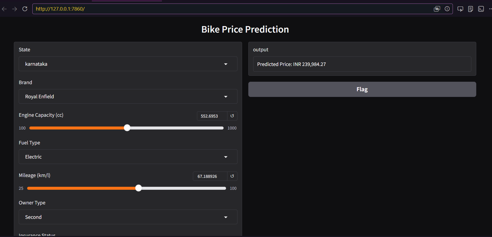
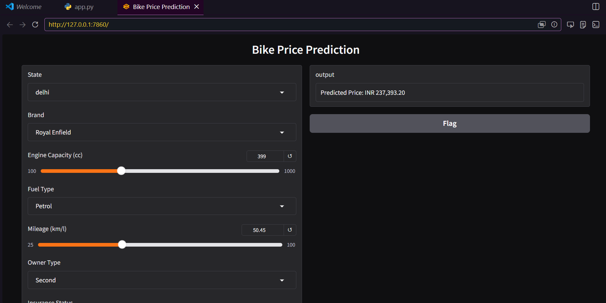

# Bike Price Prediction Model

A machine learning-based application to predict bike prices based on various features like brand, engine capacity, fuel type, mileage, and more.

## 📋 Project Overview

This project implements a price prediction model for bikes using machine learning. It takes into account multiple factors such as:
- Brand
- Engine Capacity (cc)
- Fuel Type
- Mileage (km/l)
- Owner Type
- Insurance Status
- Seller Type
- Resale Price
- City Tier
- State

The model is deployed using **Gradio** for an interactive web-based interface.

## 🛠️ Tech Stack

- **Python 3.x** - Core programming language
- **Scikit-learn (sklearn)** - Machine learning library for model training and prediction
- **Pandas** - Data manipulation and analysis
- **Gradio** - Interactive web interface for the model
- **Pickle** - Model serialization and deserialization

## 📁 Project Structure

```
Bike model/model 2 price prediction/
├── app.py                           # Main application file with Gradio interface
├── bike_price_prediction.pkl        # Trained ML model (pickle file)
├── clean_df.pkl                     # Cleaned dataset (pickle file)
├── data/                            # Raw data directory
└── src/                             # Result images and visualizations
    ├── result.png                   # Model performance visualization
    └── result2.png                  # Additional result visualization
```

## 🎯 Results

### Model Performance Visualizations





## 🚀 How to Run

1. **Install Dependencies:**
   ```bash
   pip install -r requirements.txt
   ```

2. **Run the Application:**
   ```bash
   python "Bike model/model 2 price prediction/app.py"
   ```

3. **Access the Interface:**
   - The Gradio interface will launch in your browser (typically at `http://localhost:7860`)
   - Fill in the bike details using the dropdown menus and sliders
   - Click the submit button to get the predicted price

## 📊 Input Parameters

| Parameter | Type | Description |
|-----------|------|-------------|
| State | Dropdown | State where the bike is located |
| Brand | Dropdown | Bike brand/manufacturer |
| Engine Capacity | Slider | Engine capacity in cc |
| Fuel Type | Dropdown | Type of fuel (Petrol/Diesel/etc.) |
| Mileage | Slider | Fuel efficiency in km/l |
| Owner Type | Dropdown | Individual/Commercial owner |
| Insurance Status | Dropdown | Insurance coverage status |
| Seller Type | Dropdown | Dealer/Individual seller |
| Resale Price | Slider | Current resale value in INR |
| City Tier | Dropdown | City tier (Tier 1/2/3) |

## 💾 Model Details

- **Model File:** `bike_price_prediction.pkl`
- **Data File:** `clean_df.pkl`
- **Output:** Predicted bike price in INR (Indian Rupees) with 2 decimal places

## 🔧 Dependencies

See `requirements.txt` for complete list of dependencies:
- gradio
- pandas
- scikit-learn
- pickle

## 📝 Notes

- The model and dataset are pre-trained and stored as pickle files
- Ensure both `.pkl` files are in the same directory as `app.py`
- The Gradio interface automatically populates dropdown options from the dataset

## 👨‍💻 Author

Mayank Gariya

## 📄 License

Feel free to use and modify this project for your needs.
