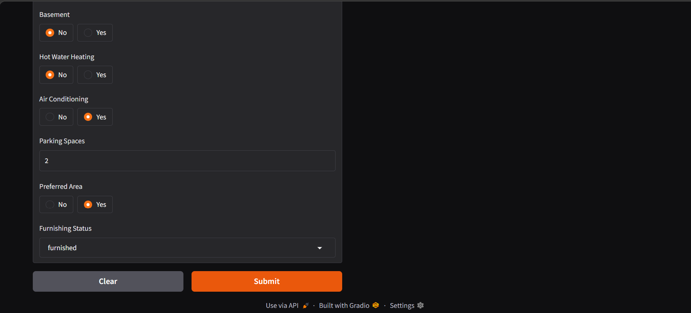

# 🏠 House Price Prediction Model

> *Accurately predict house prices using machine learning. Built with passion for data science.*

[](https://python.org)
[](LICENSE)
[]()

---

## 📖 About This Project

Hey there! I'm **Mayank Gariya**, and this is one of my machine learning projects that I'm really proud of. This House Price Prediction model is designed to forecast residential property prices based on various features like area, location, amenities, and more. 

Whether you're a real estate professional, a data enthusiast, or someone curious about ML, this project demonstrates end-to-end machine learning workflow—from data exploration and preprocessing to model training and deployment with an interactive web interface.

---

## ✨ Key Features

- **🎯 Accurate Predictions**: ML model trained on real housing data with optimized performance
- **💻 Interactive UI**: User-friendly Gradio interface for easy predictions
- **📊 Multiple Features**: Considers 12 different property characteristics
- **🔄 End-to-End Pipeline**: Complete ML workflow from data cleaning to deployment
- **📈 Data-Driven**: Built on comprehensive housing dataset analysis
- **🚀 Production Ready**: Serialized model for quick inference

---

## 🛠️ Tech Stack

<div align="center">

| **Framework** | **Libraries** | **Tools** |
|:---:|:---:|:---:|
|  |  |  |
|  |  |  |

</div>

**Core Dependencies:**
- **Pandas** - Data manipulation and analysis
- **NumPy** - Numerical computing
- **Scikit-learn** - Machine learning algorithms & preprocessing
- **Gradio** - Web interface for model interaction
- **Joblib** - Model serialization

---

## 📊 Project Structure

```
house price predictor/
├── 📓 src/
│   ├── price predication model .ipynb    # Main ML model development
│   ├── price .ipynb                      # Exploratory data analysis
│   ├── Housing.csv                       # Training dataset
│   ├── screen shot.png                   # Model performance visualization
│   └── Screenshot2.png                   # Results showcase
├── 🐍 app.py                             # Gradio web application
├── 🤖 model.pkl                          # Trained ML model
└── 📄 README.md                          # This file
```

---

## 🎬 Quick Start

### Prerequisites
```bash
Python 3.8 or higher
pip (Python package manager)
```

### Installation

1. **Clone the repository** (if you haven't already)
```bash
git clone https://github.com/mayank-gariya/projects.git
cd projects/house\ price\ predictor
```

2. **Install required packages**
```bash
pip install -r requirements.txt
```

Or install individually:
```bash
pip install gradio joblib pandas numpy scikit-learn
```

### Running the Application

3. **Launch the web interface**
```bash
python app.py
```

4. **Access the app** - Open your browser and navigate to the local URL (typically `http://127.0.0.1:7860`)

5. **Make predictions** - Fill in the property details and click "Submit" to get instant price predictions!

---

## 📸 Visual Overview

### Model Performance

*Visualization of model performance and key metrics*

### Web Interface

*Interactive Gradio interface for price predictions*

---

## 🧠 How It Works

### Input Features
The model considers the following 12 property characteristics:

| Feature | Type | Description |
|---------|------|-------------|
| **Area** | Numeric | Property size in square feet |
| **Bedrooms** | Numeric | Number of bedrooms |
| **Bathrooms** | Numeric | Number of bathrooms |
| **Stories** | Numeric | Number of floors/stories |
| **Main Road Access** | Binary | Yes/No - Direct access to main road |
| **Guest Room** | Binary | Yes/No - Dedicated guest room |
| **Basement** | Binary | Yes/No - Has basement |
| **Hot Water Heating** | Binary | Yes/No - Hot water system |
| **Air Conditioning** | Binary | Yes/No - A/C available |
| **Parking Spaces** | Numeric | Number of parking spaces |
| **Preferred Area** | Binary | Yes/No - Located in preferred area |
| **Furnishing Status** | Categorical | Furnished/Semi-furnished/Unfurnished |

### Model Pipeline
The trained model incorporates:
- ✅ Feature scaling & normalization
- ✅ Categorical encoding
- ✅ Advanced regression algorithms
- ✅ Hyperparameter optimization
- ✅ Cross-validation for reliability

### Output
The model returns a **predicted price in INR (Indian Rupees)** with high accuracy based on the input features.

---

## 📈 Model Development

The complete model development process is documented in the Jupyter notebooks:

- **`price predication model .ipynb`** - Main notebook with:
  - Exploratory Data Analysis (EDA)
  - Data preprocessing and cleaning
  - Feature engineering
  - Model training and evaluation
  - Hyperparameter tuning
  - Final model selection and export

- **`price .ipynb`** - Additional analysis and insights

All notebooks follow best practices in data science and include detailed explanations.

---

## 🎯 Use Cases

This model can be useful for:

- 🏢 **Real Estate Professionals** - Quick property valuations
- 💰 **Home Buyers/Sellers** - Market price estimation
- 📊 **Investors** - Investment decision-making
- 📚 **Students** - Learning practical ML implementation
- 🔍 **Data Analysts** - Understanding prediction patterns

---

## 🚀 Deployment

The application is built with **Gradio**, making it easy to:
- Share via public link (`share=True`)
- Deploy to HuggingFace Spaces
- Integrate into larger applications
- Run locally for privacy

Simply run `python app.py` and Gradio will provide a shareable link!

---

## 📋 Requirements

All dependencies are listed in the tech stack section. To install:

```bash
pip install gradio joblib pandas numpy scikit-learn
```

The `model.pkl` file contains the pre-trained model, so you don't need to retrain unless you want to.

---

## 🤝 About Me

Hi! I'm **Mayank Gariya**, a passionate data scientist and machine learning enthusiast. I love building projects that solve real-world problems through data and AI.

**Connect with me:**
- 🐙 GitHub: [@mayank-gariya](https://github.com/mayank-gariya)
- 💼 LinkedIn: [Mayank Gariya](https://linkedin.com/in/mayank-gariya)
- 📧 Email: [Get in touch!](mailto:mayank.gariya@example.com)
- 🌐 Portfolio: [Visit my profile](https://github.com/mayank-gariya)

---

## 💡 Future Enhancements

- [ ] Add more advanced models (XGBoost, LightGBM)
- [ ] Include confidence intervals for predictions
- [ ] Expand dataset with more diverse properties
- [ ] Add location-based features (latitude, longitude)
- [ ] Implement real-time model updates
- [ ] Add explanation feature (SHAP values)
- [ ] Mobile app version

---

## 📝 Notes

- The model was trained on a real housing dataset with careful data preprocessing
- All predictions are estimates and should be used as reference, not as absolute values
- For production use, consider retraining with more recent data
- The model performs best for properties within the range of the training data

---

## 📄 License

This project is open source and available under the MIT License. Feel free to use it for educational and commercial purposes.

---

## 🙏 Acknowledgments

- Special thanks to the open-source community for the amazing libraries
- Dataset sourced from real housing market data
- Built with ❤️ and a passion for machine learning

---

<div align="center">

**Made with ❤️ by Mayank Gariya**

*If you found this project helpful, consider giving it a ⭐ on GitHub!*

</div>

---

*Last Updated: May 2026 | Maintained by Mayank Gariya*