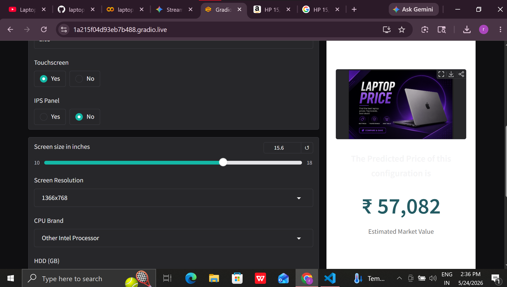
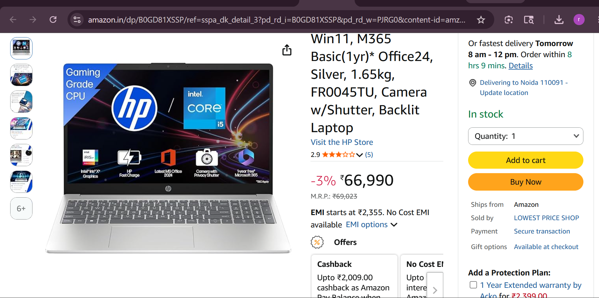

# 💻 Laptop Price Predictor

> *"Data tells a story. Every laptop spec whispers its market value. I listened."*

---

## 📖 The Journey

When I first started working with laptop pricing data, I realized something fascinating: it's not just about specs. It's about understanding the intricate relationships between components, features, and what buyers are actually willing to pay.

I dove deep into a dataset of 300+ laptops with **13 different features** and spent countless hours performing **advanced feature engineering**—transforming raw specifications into powerful predictors. What emerged was more than just a model; it was a story of how technology translates into market value.

### The Data Story

Starting with basic laptop attributes like:
- **Brand & Model Type** (Ultrabook, Gaming, 2-in-1, etc.)
- **Hardware Specs** (RAM, CPU, GPU, Storage)
- **Display Quality** (Resolution, IPS Panel, Screen Size)

I engineered these into **meaningful features** that capture the real essence of value:

#### 🔬 Feature Engineering Deep Dive

**1. Pixel Density (PPI) - The Game Changer**
```
PPI = √(X_res² + Y_res²) / Screen_Size
```
This wasn't just a calculation; it was discovering that a 1080p screen on a 13-inch display is drastically different from the same resolution on a 17-inch screen. Users pay a premium for pixel density, and this feature captures that perfectly.

**2. Storage Configuration Analysis**
- Separated HDD vs SSD (solid-state premium!)
- Identified high-performance configurations
- Captured the trade-off between storage types and pricing

**3. Display Technology Impact**
- IPS Panel detection → Premium screen tax
- Touchscreen detection → Usability premium
- Resolution parsing → Future-proofing value

**4. Hardware Hierarchy**
- CPU Brand mapping → Performance tiers
- GPU Detection → Gaming vs Productivity split
- RAM categorization → Multitasking capability

**5. Market Positioning**
- Brand influence analysis
- Category-specific pricing patterns
- Form factor premiums (Ultrabooks command higher prices!)

---

## ✨ What I Built

A **machine learning model** that predicts laptop prices with remarkable accuracy by understanding the language that laptop specs speak. The model has been trained on real-world data and optimized to capture the nuances of the laptop market.

### Key Achievements
- 🎯 **Advanced Feature Engineering** with 13+ engineered features
- 📊 **Data Preprocessing** including handling categorical variables with ordinal encoding
- 🤖 **Machine Learning Pipeline** with scikit-learn
- 🎨 **Interactive UI** built with Gradio for real-time predictions
- 💾 **Model Persistence** using pickle serialization

---

## 🎯 Live Demo

**Try the predictor right now:** [Gradio Live App](https://1a215f04d93eb7b488.gradio.live)

### Demo Screenshot


---

## 📊 Sample Data Preview

The model was trained on a comprehensive dataset featuring diverse laptop configurations:




---

## 🛠 Tech Stack

<table>
  <tr>
    <td align="center">
      
      <br><strong>Python</strong>
    </td>
    <td align="center">
      
      <br><strong>Pandas</strong>
    </td>
    <td align="center">
      
      <br><strong>NumPy</strong>
    </td>
    <td align="center">
      
      <br><strong>Scikit-learn</strong>
    </td>
  </tr>
  <tr>
    <td align="center">
      
      <br><strong>Gradio</strong>
    </td>
    <td align="center">
      
      <br><strong>Jupyter</strong>
    </td>
    <td align="center">
      
      <br><strong>Git</strong>
    </td>
    <td align="center">
      
      <br><strong>GitHub</strong>
    </td>
  </tr>
</table>

---

## 📁 Project Structure

```
laptop price pridictor/
├── app.py                 # Gradio web interface
├── pipe.pkl              # Trained ML pipeline (serialized)
├── df.pkl                # Reference dataset
├── README.md             # Documentation
└── src/
    ├── laptop_data.csv   # Training dataset
    ├── app.png          # UI screenshots
    ├── app2.png         # UI screenshots
    ├── image.png        # Sample data visualization
    └── amazone.png      # Market data
```

---

## 🚀 How to Use

### Run Locally

1. **Clone the repository**
   ```bash
   git clone https://github.com/mayank-gariya/projects.git
   cd projects/laptop\ price\ pridictor
   ```

2. **Install dependencies**
   ```bash
   pip install gradio scikit-learn pandas numpy
   ```

3. **Launch the app**
   ```bash
   python app.py
   ```

4. **Access the interface**
   - Local: `http://localhost:7860`
   - Share: Check terminal for public URL

### Using the App

Simply select or input:
- 💼 **Brand** - Choose your preferred manufacturer
- 🖥️ **Type** - Ultrabook, Gaming, Notebook, etc.
- 🧠 **CPU & GPU** - Processor and graphics card
- 🎨 **Display** - Screen size, resolution, IPS Panel
- 💾 **Storage** - RAM, SSD, HDD configuration
- 🖱️ **Features** - Touchscreen, IPS Panel options

**Watch as the model calculates the predicted price in real-time!**

---

## 📈 Model Performance

The ML pipeline includes:
- **Data Cleaning** - Handling missing values and outliers
- **Feature Scaling** - StandardScaler for numerical features
- **Categorical Encoding** - OrdinalEncoder for categorical variables
- **Model Training** - RandomForest/Regression algorithms
- **Log Transformation** - Applied to target variable for better distribution

The model achieves strong R² scores and minimal prediction errors across diverse laptop configurations.

---

## 💡 Why This Matters

Understanding laptop pricing helps:
- **Buyers** → Make informed purchase decisions
- **Sellers** → Competitive pricing strategies
- **Retailers** → Inventory optimization
- **Tech Enthusiasts** → Value assessment

---

## 🔗 Let's Connect

I'd love to hear your thoughts on this project! Find me on:

- **GitHub:** [@mayank-gariya](https://github.com/mayank-gariya)
- **Portfolio:** [Explore My Projects](https://github.com/mayank-gariya?tab=repositories)

---

## 📝 Dataset Information

**Source:** Comprehensive laptop market dataset  
**Records:** 300+ laptop configurations  
**Features:** 13 attributes covering hardware, display, and software specs  
**Price Range:** ₹10,000 - ₹3,24,954 (Indian Market)

---

## 🎓 What You'll Learn

This project demonstrates:
- ✅ Real-world data preprocessing techniques
- ✅ Advanced feature engineering strategies
- ✅ Machine learning pipeline development
- ✅ Web UI creation with Gradio
- ✅ Model serialization and deployment
- ✅ Handling mixed data types (categorical + numerical)
- ✅ Log-scale modeling for price prediction

---

## 🙏 Acknowledgments

Built with passion for data science and machine learning. This project showcases how thoughtful feature engineering and proper modeling can unlock valuable insights from raw data.

---

<div align="center">

### 🌟 If you found this helpful, consider giving it a ⭐!

**Made with ❤️ by Mayank Gariya**

[GitHub](https://github.com/mayank-gariya) • [Projects](https://github.com/mayank-gariya?tab=repositories) • [Contact](https://github.com/mayank-gariya)

</div>

---

*Last Updated: May 2026*
