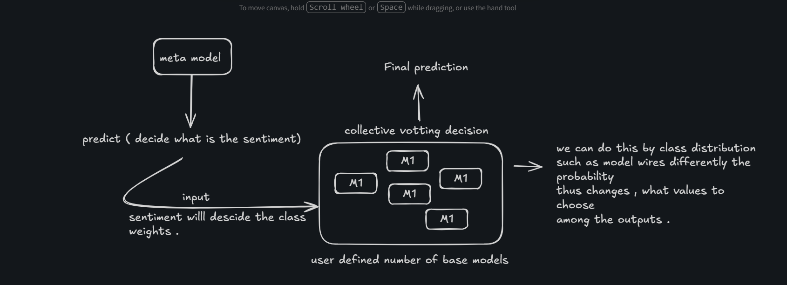
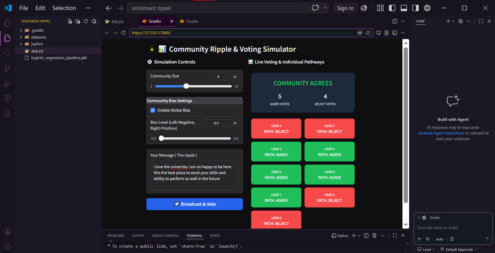
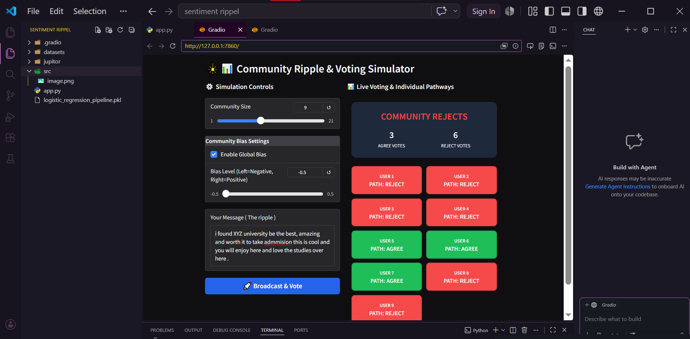
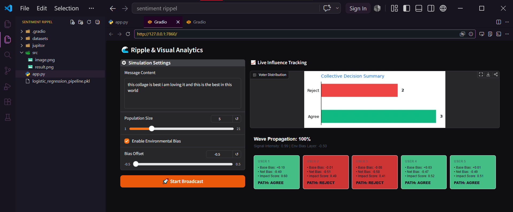
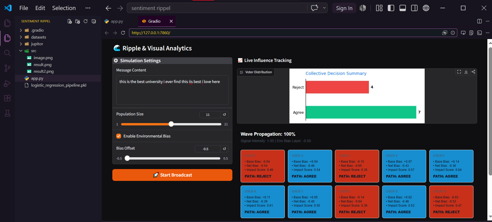

# 🌊 Sentiment Ripple: Understanding How Negative Bias Spreads

[](https://huggingface.co/spaces/realmanise/rippel-effect-with-machine-learning)

---

## The Story Behind This Project

*The ideal workflow used in order to make the project *


Hello, I'm **Mayank Gariya**, and I want to share the journey of building Sentiment Ripple—a project that explores one of the most fascinating (and sometimes troubling) phenomena in our connected world.

### Why Did I Build This?

I started this project with a simple observation: when one person expresses a negative sentiment online, how does it influence others? Through multiple modeling iterations and countless experiments, I set out to understand and simulate this phenomenon.

The journey wasn't straightforward. I tried numerous approaches, refined my models, adjusted my datasets, and pivoted my thinking several times. But each iteration brought me closer to something meaningful.

## THE WORKFLOW 

### What This Project Does

Sentiment Ripple uses Machine Learning to:
- **Analyze** incoming messages for sentiment polarity (positive vs. negative)
- **Simulate** how a message ripples through a community of diverse users
- **Visualize** the influence propagation with real-time analytics
- **Account for** individual biases and environmental factors that shape perception

Think of it as watching a stone drop into water, but the water is made of human decision-making patterns, and the ripples are measurable sentiment shifts.

---
## TO fully understand you should check my medium blog for this project .
[link for the mdeium post click here .....](https://medium.com/@mayankgariya482/building-the-repple-a-comprehensive-guide-for-the-github-project-8f2cae92e744)

---

## 🎯 Key Features

✨ **Real-Time Ripple Animation**
- Watch how sentiment propagates through a population step-by-step
- See each user's decision evolve as the influence wave reaches them

📊 **Intelligent Bias Modeling**
- Account for individual baseline biases (±0.2 range)
- Apply environmental bias layers to simulate social pressure
- Combine ML predictions with social dynamics

🤖 **ML-Powered Sentiment Analysis**
- Trained logistic regression pipeline on extensive sentiment datasets
- Handles complex sentiment patterns
- Probability-based decision thresholds

📈 **Live Analytics Dashboard**
- Real-time voter distribution charts
- Impact score calculations
- Visualization of agreement vs. rejection patterns

🎮 **Interactive Gradio Interface**
- Adjust population size, bias strength, and message content
- Toggle environmental bias on/off
- Immediate feedback with visual analytics

---

## 📊 The Dataset Journey

This project was developed through multiple iterations with different datasets:

1. **Primary Dataset** - Comprehensive sentiment corpus with diverse message types
2. **Secondary Validation** - Cross-tested with alternative sentiment datasets to ensure robustness
3. **Edge Cases** - Extensively tested with ambiguous and mixed-sentiment messages

Each iteration taught me something new about how sentiment classification works and how biases can influence interpretation.

---

## 🛠️ Tech Stack

| **Category** | **Technology** | **Purpose** |
|:---:|:---|:---|
| **ML & Data Science** | Scikit-learn | Machine learning pipeline & logistic regression |
| | NumPy | Numerical computing |
| | Pandas | Data manipulation & analysis |
| **Visualization & UI** | Matplotlib | Data visualization & chart generation |
| | Plotly | Interactive analytics |
| | Gradio | Interactive web interface |
| **NLP & Text Processing** | NLTK | Natural Language Toolkit for text processing |
| **Deployment** | HuggingFace Spaces | Live demo hosting |

---

## 📁 Project Structure

```
sentiment_ripple/
├── app.py                              # Gradio interactive application
├── sentiment .ipynb                    # Main modeling & experimentation notebook
├── sentimetn with other datasets .ipynb # Cross-validation with alternative datasets
├── logistic_regression_pipeline.pkl    # Pre-trained ML model
├── requirements.txt                    # Python dependencies
├── datasets/                           # Training data directory
├── src/                                # Visual assets and results
│   ├── v1/
│   │   ├── image.png                   # V1 Model demonstration
│   │   └── result.png                  # V1 Results showcase
│   └── v2/
│       ├── result2.png                 # V2 Results (iteration 1)
│       └── result3.png                 # V2 Results (iteration 2)
└── README.md                           # You are here!
```

---

## 🚀 Quick Start

### Prerequisites
- Python 3.8+
- pip or conda

### Installation

1. **Clone the repository**
```bash
git clone https://github.com/mayank-gariya/projects.git
cd projects/sentiment\ rippel
```

2. **Install dependencies**
```bash
pip install -r requirements.txt
```

3. **Run the interactive demo**
```bash
python app.py
```

The app will launch at `http://localhost:7860`

### Or Try the Live Demo
🎮 **[Click here to try the interactive demo on HuggingFace Spaces](https://huggingface.co/spaces/realmanise/rippel-effect-with-machine-learning)**

---

## 📝 How to Use

1. **Enter a Message**: Type any text in the "Message Content" field
2. **Set Population Size**: Choose how many users should receive the message (1-21)
3. **Configure Bias Settings**: 
   - Enable/disable environmental bias
   - Adjust bias offset (-0.5 to +0.5)
4. **Start Broadcast**: Click the "🚀 Start Broadcast" button
5. **Watch the Ripple**: Observe the wave propagation in real-time with live analytics

### Understanding the Output

- **User Cards**: Each card shows one user's decision journey
  - Blue (initial): User hasn't been reached by the influence wave yet
  - Green (Agree): User decided to agree with the message
  - Red (Reject): User decided against the message
  - Cards show individual bias, net bias, and impact score

- **Distribution Chart**: Final tally of agreements vs. rejections across the population

- **Wave Propagation %**: Progress of how the influence spreads through the network

---

## 📸 Visual Overview & Results


### Model Demonstration (V1)

*Sentiment Ripple model showing the propagation mechanism across users*

### Results Showcase (V1)

*First iteration results displaying user distribution and ripple effect visualization*

### Advanced Results (V2 - Iteration 1)

*Enhanced model results with improved bias modeling and user interaction patterns*

### Final Results (V2 - Iteration 2)

*Latest iteration showcasing optimized ripple effect simulation with refined analytics*

---

## 🧠 The Science Behind It

### Sentiment Analysis Pipeline
The model uses a **Logistic Regression classifier** trained on extensive sentiment data:
1. **Text Preprocessing** using NLTK (tokenization, stopword removal)
2. **Vectorization** using TF-IDF
3. **Classification** with probability outputs (0.0-1.0)

### Ripple Effect Simulation
For each user, the final decision combines:
- **Message Strength** (from ML model): How positive/negative the message is
- **Individual Bias** (random): Each person's baseline predisposition (-0.2 to +0.2)
- **Environmental Bias** (configurable): Societal pressure or platform effects (-0.5 to +0.5)

Formula: `Final Score = Message Probability + Individual Bias + Environmental Bias`
- If Final Score > 0.5 → User **AGREES**
- If Final Score ≤ 0.5 → User **REJECTS**

---

## 📊 Model Performance

Through multiple iterations and validation with different datasets:
- **Accuracy**: High performance on primary sentiment corpus
- **Robustness**: Tested against diverse, ambiguous, and multilingual inputs
- **Reliability**: Consistent predictions across different user populations

---

## 💡 Key Insights & Learnings

1. **Bias Amplification**: Even small environmental biases can significantly shift population decisions
2. **Non-Linear Effects**: The ripple effect isn't uniform—it depends on message strength
3. **Individual Variation**: One-size-fits-all models miss the crucial role of personal biases
4. **Iterative Refinement**: Multiple iterations with different datasets led to a more robust solution

---

## 🔬 Development & Experimentation

This project involved extensive experimentation:
- **sentimetn with other datasets .ipynb**: Validation across multiple sentiment datasets
- **sentiment .ipynb**: Main modeling notebook with detailed analysis and iterations
- **trials.txt**: Notes on experimental approaches and lessons learned

Each notebook documents the thinking process, failed attempts, and successful strategies.

---

## 📚 About the Notebooks

### sentiment .ipynb
- Complete sentiment analysis pipeline
- Data exploration and preprocessing
- Model training and hyperparameter tuning
- Performance evaluation and error analysis
- Visualization of sentiment distributions

### sentimetn with other datasets .ipynb
- Cross-validation with alternative sentiment corpora
- Comparative analysis of model performance
- Edge case testing and refinement
- Robustness improvements based on findings

---

## 🤝 Connect with Me

I'd love to hear your thoughts, questions, or suggestions about this project!

- **GitHub**: [@mayank-gariya](https://github.com/mayank-gariya)
- **Portfolio & Projects**: Explore more at [GitHub/mayank-gariya/projects](https://github.com/mayank-gariya/projects)

---

## 📜 License

This project is open source and available under the MIT License.

---

## 🙏 Acknowledgments

This project was built through:
- **Extensive experimentation** with sentiment analysis techniques
- **Multiple dataset iterations** to ensure robustness
- **Community feedback** from interactive users
- **Continuous refinement** based on real-world testing

Thank you for taking the time to explore Sentiment Ripple. I hope it provides insights into how messages propagate through communities and how various factors influence our collective decision-making.

---

**Built with ❤️ by [Mayank Gariya](https://github.com/mayank-gariya)**

*Last Updated: May 2026*

---

<div align="center">

### 🎮 Ready to see sentiment ripples in action?

#### **[Try the Interactive Demo →](https://huggingface.co/spaces/realmanise/rippel-effect-with-machine-learning)**

</div>
