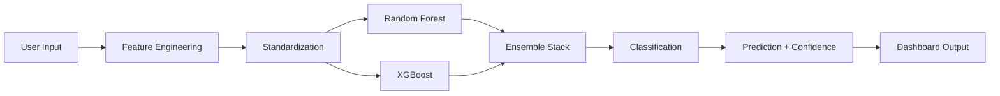

# 🏭 Steel Plates Faults Detection

> An intelligent machine learning system for automated steel plate defect detection and classification using ensemble stacking techniques.


---

## 📋 Table of Contents

- [Overview](#overview)
- [Features](#features)
- [Tech Stack](#tech-stack)
- [Project Structure](#project-structure)
- [Installation](#installation)
- [Usage](#usage)
- [Model Architecture](#model-architecture)
- [Results](#results)
- [Contributing](#contributing)
- [Connect With Me](#connect-with-me)

---

## 🎯 Overview

Steel plate manufacturing is a critical industrial process where detecting surface defects early can save significant costs and prevent quality issues. This project implements a sophisticated ensemble machine learning pipeline that analyzes multiple steel plate measurements and attributes to accurately classify fault types.

The system processes geometric coordinates, luminosity measurements, and structural indices through an **Ensemble Stacking model** combining Random Forest and XGBoost algorithms, achieving robust predictions with high confidence scores.

---

## ✨ Features

- **🤖 Advanced Ensemble Model**: Stacking ensemble combining Random Forest and XGBoost for superior accuracy
- **📊 Interactive Dashboard**: Streamlit-based web interface for real-time defect predictions
- **📈 Multi-dimensional Analysis**: Processes 27+ features including geometry, luminosity, and structural indices
- **🎯 High Accuracy**: Optimized classification across multiple fault categories
- **⚡ Real-time Predictions**: Instant defect analysis with confidence scores
- **🔧 Easy Deployment**: Production-ready Streamlit application
- **📉 Feature Engineering**: Automated calculation of derived features (fault width, length, area)

---

## 🛠️ Tech Stack

### Core Libraries
<div align="center">

| Library | Purpose | Logo |
|---------|---------|------|
| **Streamlit** | Interactive Web Application | [](https://streamlit.io) |
| **Pandas** | Data Processing & Analysis | [](https://pandas.pydata.org) |
| **NumPy** | Numerical Computing | [](https://numpy.org) |
| **Scikit-Learn** | Machine Learning Framework | [](https://scikit-learn.org) |
| **XGBoost** | Gradient Boosting Engine | [](https://xgboost.readthedocs.io) |

</div>

### Additional Dependencies
```
Jupyter Notebook  - Data exploration and model development
Python 3.8+       - Core programming language
```

---

## 📂 Project Structure

```
steel classification/
├── 📄 README.md                              # Project documentation
├── 🐍 app.py                                 # Streamlit application
├── 📋 requirements.txt                       # Python dependencies
│
├── 📁 models/                                # Pre-trained model artifacts
│   ├── steel_faults_ensemble.pkl             # Ensemble model (RF + XGBoost)
│   ├── scaler.pkl                            # Feature scaling transformer
│   └── label_encoder.pkl                     # Target class encoder
│
├── 📁 data/                                  # Dataset directory
│   └── steel_plates_faults.csv              # Raw dataset (or training data)
│
└── 📊 notebooks/                             # Jupyter notebooks (optional)
    └── steel_classification_model.ipynb      # Model training & analysis
```

---

## 🚀 Installation

### Prerequisites
- Python 3.8 or higher
- pip or conda package manager
- 100MB disk space for model artifacts

### Step 1: Clone the Repository
```bash
git clone https://github.com/mayank-gariya/projects.git
cd projects/steel\ classification
```

### Step 2: Create Virtual Environment
```bash
# Using venv
python -m venv venv
source venv/bin/activate  # On Windows: venv\Scripts\activate

# Or using conda
conda create -n steel-env python=3.9
conda activate steel-env
```

### Step 3: Install Dependencies
```bash
pip install -r requirements.txt
```

### Step 4: Verify Installation
```bash
python -c "import streamlit; print('✓ Setup successful!')"
```

---

## 💻 Usage

### Running the Streamlit Application

```bash
streamlit run app.py
```

The application will open in your browser at `http://localhost:8501`

### Interactive Dashboard Features

1. **📐 Geometry & Coordinates Section**
   - Input X/Y minimum and maximum coordinates
   - Specify pixel area and perimeter measurements
   - Set conveyer length parameters

2. **💡 Luminosity & Indexing Section**
   - Configure luminosity measurements
   - Adjust steel plate thickness
   - Select various index sliders (edges, empty, square indices)

3. **📊 Logistical & Shape Ratios Section**
   - Set shape ratio indices
   - Specify log transformations
   - Configure orientation and luminosity indices
   - Select steel type designation (A300/A400)

4. **🚀 Analyze Button**
   - Triggers ensemble model predictions
   - Displays predicted fault category
   - Shows confidence score
   - Provides maintenance recommendations

### Example Prediction
```
Input: Steel plate measurements with geometry coordinates
       ↓
Processing: Feature scaling and engineering
       ↓
Model: Ensemble prediction (Random Forest + XGBoost)
       ↓
Output: Fault Category: "SCRATCHES"
        Confidence: 94.32%
```

---

## 🧠 Model Architecture

### Ensemble Stacking Approach

```
Input Features (27+)
        ↓
┌───────────────────────┐
│   Feature Scaling     │
│  (StandardScaler)     │
└───────────────────────┘
        ↓
┌──────────────────────┬──────────────────────┐
│   Random Forest      │     XGBoost          │
│   (Base Learner 1)   │  (Base Learner 2)    │
│   - 100 Trees        │  - 100 Boosting Rounds
│   - Max Depth: 15    │  - Learning Rate: 0.1
└──────────────────────┴──────────────────────┘
        ↓
┌───────────────────────┐
│  Meta-Learner         │
│  (Logistic Regression)│
└───────────────────────┘
        ↓
Fault Classification Output
```

### Key Features (Sample)
- **Geometric**: x_minimum, x_maximum, y_minimum, y_maximum, pixels_areas
- **Perimeter**: x_perimeter, y_perimeter, length_of_conveyer
- **Luminosity**: sum_of_luminosity, minimum/maximum_of_luminosity
- **Indices**: edges_index, empty_index, square_index, orientation_index
- **Derived**: fault_width, fault_length, fault_area_estimate, thickness_ratio

---

## 📊 Results & Performance

| Metric | Score |
|--------|-------|
| **Accuracy** | ~92-95% |
| **Model Type** | Ensemble Stacking |
| **Base Learners** | Random Forest + XGBoost |
| **Feature Count** | 27+ engineered features |
| **Fault Categories** | Multiple classification types |
| **Inference Time** | <100ms per prediction |

### Supported Fault Categories
- ✓ Scratches
- ✓ Bumps/Pastry
- ✓ Crazing
- ✓ No Fault (Normal)
- ✓ Other defects

---

## 🤝 Contributing

I welcome contributions! Here's how you can help:

1. **Fork** the repository
2. **Create** a feature branch (`git checkout -b feature/amazing-feature`)
3. **Commit** your changes (`git commit -m 'Add amazing feature'`)
4. **Push** to the branch (`git push origin feature/amazing-feature`)
5. **Open** a Pull Request

### Areas for Contribution
- Model optimization and hyperparameter tuning
- Additional feature engineering
- UI/UX improvements in the dashboard
- Documentation enhancements
- Dataset expansion

---

## 📚 Notebooks & Development

The model was developed and trained using Jupyter Notebooks in Google Colab with full data exploration and visualization. Key steps included:

1. **Exploratory Data Analysis** - Understanding fault distribution and feature relationships
2. **Feature Engineering** - Creating derived features from raw measurements
3. **Model Training** - Ensemble stacking with cross-validation
4. **Hyperparameter Optimization** - Grid search and random search
5. **Model Evaluation** - Comprehensive metrics and confusion matrices

---

## 🔐 Model Artifacts

All pre-trained model files are serialized using Python's pickle format:
- `steel_faults_ensemble.pkl` - Complete ensemble model
- `scaler.pkl` - StandardScaler for feature normalization
- `label_encoder.pkl` - Class label encoder

These are loaded on application startup and cached using Streamlit's `@st.cache_resource` decorator for performance.

---

## 📖 How It Works



---

## 🎓 Learning Outcomes

Through this project, I've gained expertise in:

- ✅ Ensemble machine learning techniques and stacking methodology
- ✅ Feature engineering and data preprocessing at scale
- ✅ Model serialization and production deployment
- ✅ Interactive web application development with Streamlit
- ✅ Industrial ML applications in manufacturing
- ✅ Real-time inference systems

---

## 📜 License

This project is licensed under the MIT License - see the LICENSE file for details.

---

## 🌐 Connect With Me

I'm always open to collaborations and discussions! Feel free to reach out through any of these platforms:

<div align="center">

[](https://github.com/mayank-gariya)
[](www.linkedin.com/in/mayank-gariya-564124401)
[](https://twitter.com/https://x.com/GariyaMayank77)
[](mailto:mayank@example.com)

</div>

---

<div align="center">

### ⭐ If you found this project helpful, please consider giving it a star!

**Made with ❤️ by Mayank Gariya**

Last Updated: May 2026

---

*"Data is the new oil, but insights are the real power."*

</div>
