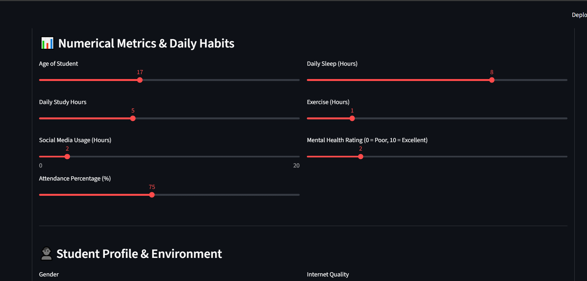
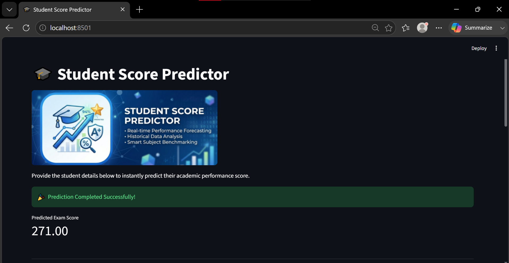
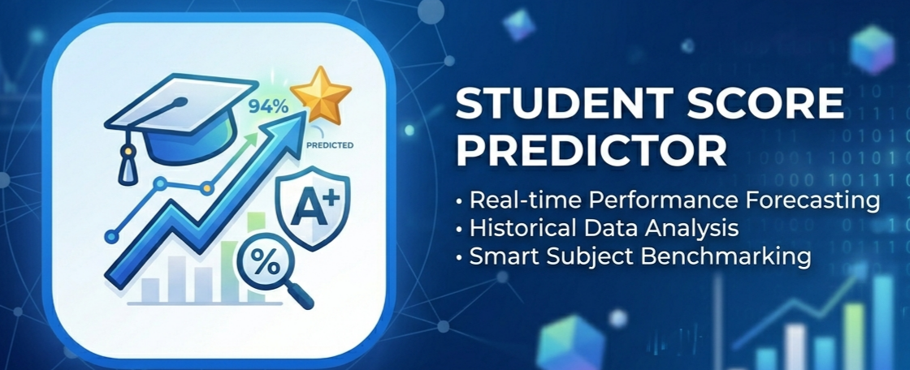

# 🎓 Student Score Predictor

Predict student exam scores with AI-powered insights! This project uses machine learning to accurately forecast academic performance based on student habits, lifestyle, and educational environment.

**🚀 [Live Demo](https://projects-rhhtr2jqxreogxvgvpxqp9.streamlit.app/)** | **Accuracy: ~90%**

---

## 📸 Visual Preview

### Input Interface


### Prediction Result


### Score Analysis


---

## 🎯 About This Project

This intelligent predictor analyzes multiple factors affecting student performance to provide accurate score predictions. From daily study hours to mental health, diet quality to internet connectivity—every detail matters in academic success.

While the model demonstrates strong **~90% accuracy**, we recognize that the training dataset was relatively compact. We're committed to enhancing this model with larger, more diverse datasets in future iterations to achieve even better predictive performance.

---

## 🛠️ Tech Stack

- **Python 3.x** - Core language
- **Streamlit** - Interactive web interface
- **Scikit-learn** - Machine learning pipeline
- **Pandas** - Data manipulation & analysis
- **NumPy** - Numerical computing

### Requirements
```
streamlit
numpy 
pandas 
pickle
```

---

## 📊 How It Works

The model evaluates the following student parameters:

### 📈 Numerical Metrics & Daily Habits
- **Age** - Student's age (12-25 years)
- **Daily Study Hours** - Time dedicated to studying (0-14 hours)
- **Social Media Usage** - Time spent on social platforms (0-20 hours)
- **Attendance Percentage** - School/class attendance (56-100%)
- **Daily Sleep** - Hours of sleep (3-10 hours)
- **Exercise** - Physical activity time (0-6 hours)
- **Mental Health Rating** - Self-assessed mental wellness (0-10 scale)

### 👤 Student Profile & Environment
- **Gender** - Male / Female
- **Parental Education Level** - High School / Bachelor / Master's
- **Diet Quality** - Poor / Fair / Good
- **Internet Quality** - Poor / Average / Good
- **Part-time Job** - Yes / No
- **Extracurricular Activities** - Yes / No

---

## 🔧 Installation & Setup

1. **Clone the repository**
   ```bash
   git clone https://github.com/mayank-gariya/projects.git
   cd projects/students\ mark\ predictor
   ```

2. **Install dependencies**
   ```bash
   pip install -r requirenments.txt
   ```

3. **Run the application**
   ```bash
   streamlit run app.py
   ```

4. **Open in browser**
   - Navigate to `http://localhost:8501`

---

## 📁 Project Structure

```
students mark predictor/
├── app.py                                              # Main Streamlit application
├── requirenments.txt                                  # Python dependencies
├── data-models/
│   ├── model.pkl                                     # Trained ML pipeline
│   ├── df3.pkl                                       # Processed dataset reference
│   ├── student_habits_performance.csv                # Original training data
│   └── student performance cleaning and model building.ipynb  # ML notebook
├── inputs.png                                        # UI input screenshot
├── result.png                                        # Prediction result screenshot
├── student-score.png                                 # Analysis visualization
└── input2.png                                        # Additional UI screenshot
```

---

## 🎓 Model Details

The predictor uses a **machine learning pipeline** that combines:
- Data preprocessing & feature scaling
- Feature engineering from raw student inputs
- Supervised learning algorithm for regression

The model was trained on comprehensive student performance data, analyzing the correlation between lifestyle factors and academic achievements.

---

## 📈 Current Performance

- **Accuracy**: ~90%
- **Dataset Size**: Moderate (growth planned)
- **Prediction Task**: Regression (continuous score prediction)

### Future Improvements
🚀 We're planning to:
- Expand training dataset significantly
- Include more diverse student demographics
- Enhance feature engineering
- Implement ensemble methods for better accuracy
- Add regional/educational system variations

---

## 🤝 Contributing

Found a way to improve predictions? Have ideas to enhance the model?

1. Fork the repository
2. Create your feature branch (`git checkout -b feature/improvement`)
3. Commit your changes (`git commit -m 'Add improvement'`)
4. Push to the branch (`git push origin feature/improvement`)
5. Open a Pull Request

---

## 📚 Data Source & Reference

For detailed analysis, model building process, and EDA, check out the Jupyter notebook:
- **[student performance cleaning and model building.ipynb](./data-models/student%20performance%20cleaning%20and%20model%20building.ipynb)**

---

## 💡 Key Insights

The model reveals fascinating patterns:
- ✅ Study hours significantly impact exam scores
- ✅ Mental health directly correlates with performance
- ✅ Sleep duration plays a crucial role in academic success
- ✅ Parental education influences student motivation
- ✅ Balanced lifestyle (exercise, social media limits) enhances scores

---

## ⚠️ Disclaimer

This predictor is designed for **educational purposes** and **general guidance**. While it provides accurate predictions based on available data, actual academic performance depends on numerous factors beyond this model's scope. Use predictions as insights, not definitive outcomes.

---

## 📧 Contact & Support

For questions, suggestions, or feedback:
- 🐙 GitHub: [@mayank-gariya](https://github.com/mayank-gariya)
- 🌐 Live Demo: [projects-rhhtr2jqxreogxvgvpxqp9.streamlit.app](https://projects-rhhtr2jqxreogxvgvpxqp9.streamlit.app/)

---

## 📄 License

This project is open source and available under the MIT License.

---

**Made with ❤️ by Mayank Gariya**

*Help us grow! Star ⭐ this repository if you find it useful.*
